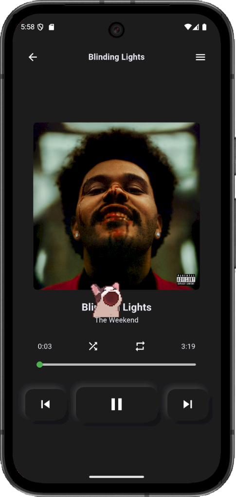
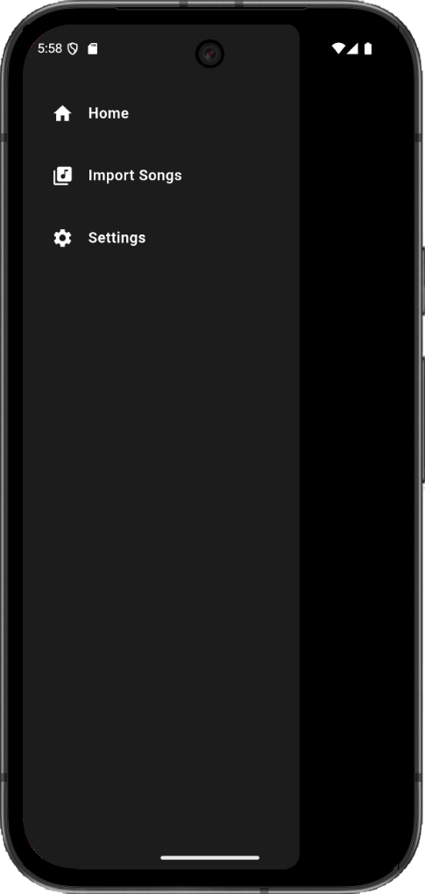

<p align="center">
  
</p>
<h1 align="center">Apollo </h1>
<p align="center">

<p align="center">
Apollo is a cross-platform music player for Android and iOS, featuring a clean and minimal UI, support for importing local files, light and dark themes, and a playful cat that dances to the beat while your music plays. (V2 offers UI enhancements, a mini player, a search bar, and more settings options.)
</p>

<p align="center">
  
  
  
  
  
</p>

---

## 🎵 Project Vision

Apollo brings music to life on mobile devices. Its minimalist interface allows you to focus on your music while enjoying interactive features, such as:  

- Importing your local music files  
- Switching between light and dark themes  
- Watching a playful cat dance along with your beats  

Apollo is free for everyone and provides a fun, immersive music experience.

---
## ✨ Download & Links

- **[Download APK (v2.0)](https://apollomusic.pythonanywhere.com/)** – Latest Android release  
- **iOS** – Coming soon  

---

## 📸 Screenshots

<p align="center">
  
  
  
  
</p>

<p align="center"><em>Apollo features both light and dark themes for comfortable listening</em></p>

**Design Credits**: Song page neumorphic UI design inspired by [Mitch](https://x.com/createdbykoko)

---

## 🌟 Features

- **Cross-Platform**: Flutter-based app for Android and iOS (iOS coming soon)  
- **Local Music Support**: Import and play your own music files  
- **Themes**: Light and dark mode for comfortable listening  
- **Beat Animation**: A dancing cat reacts to your music  
- **Minimal UI**: Intuitive, clean, and modern interface  
- **Free to Use**: No hidden costs  

---

## 🖥️ Technology Stack

- **Framework**: Flutter for cross-platform development  
- **Programming Language**: Dart  
- **UI**: Custom light and dark themes, animated widgets  
- **Audio**: Local file support and music playback features  
- **Hosting**: PythonAnywhere for web interface and APK downloads  

---

## 🚀 Getting Started

### Prerequisites
- Flutter SDK 3.13+  
- Android Studio / Xcode (for iOS build)  
- Git  

### Installation (for development)
1. Clone the repository:
   ```bash
   git clone https://github.com/Rexaintreal/Apollo.git
   cd Apollo
   ```

2. Install dependencies:
   ```bash
   flutter pub get
   ```

4. Build for your platform:
   ```bash
   flutter run
   ```

---

## 📂 Project Structure

```
Apollo/
├── android/
├── ios/
├── lib/                # Dart source code
├── assets/             # Logo, screenshots, images
├── web/
├── windows/
├── macos/
├── linux/
├── pubspec.yaml
├── README.md
└── LICENSE
```

---

## ⚡ What’s New (v2.0)

ApolloV2 is here with exciting new updates 🎉 

- **Mini Player**: Control your music seamlessly while browsing the app  
- **Customizable Settings**: More options to personalize your listening experience  
- **UI Improvements**: Cleaner, smoother, and more polished design  
- **Search Bar**: Quickly find your favorite songs  
- **Error Handling**: Better stability and smoother user experience  

<p align="center">
  <a href="https://apollomusic.pythonanywhere.com/">
    
  </a>
</p> 

---

## 📸 Screenshots (v2)

<p align="center">
  
  
  
  
</p>

<p align="center"><em>New polished UI with Mini Player & Customizable Settings in v2.0</em></p>


---

## 🔮 Future Plans

- **iOS Release**: Full support for Apple devices  
- **Playlist Management**: Create, edit, and share playlists  
- **Online Streaming**: Support cloud music streaming  
- **More Animations**: Enhanced interactive beat animations  
- **Performance Optimizations**: Smoother playback and transitions  

---

## 🤝 Contributing

Contributions are welcome!  

1. Fork the repository  
2. Create a branch: `git checkout -b feature/amazing-feature`  
3. Make your changes  
4. Commit: `git commit -m 'Add some amazing feature'`  
5. Push: `git push origin feature/amazing-feature`  
6. Open a Pull Request  

---

## 📜 License

This project is licensed under the [MIT License](LICENSE).  

---

## 💡 You may also like...

- [Libro Voice](https://github.com/Rexaintreal/Libro-Voice) - A PDF to Audio Converter
- [Snippet Vision](https://github.com/Rexaintreal/Snippet-Vision) - A YouTube Video Summarizer
- [Weather App](https://github.com/Rexaintreal/WeatherApp) - A Python Weather Forecast App
- [Python Screenrecorder](https://github.com/Rexaintreal/PythonScreenrecorder) - A Python Screen Recorder
- [Typing Speed Tester](https://github.com/Rexaintreal/TypingSpeedTester) - A Python Typing Speed Tester
- [Movie Recommender](https://github.com/Rexaintreal/Movie-Recommender) - A Python Movie Recommender
- [Password Generator](https://github.com/Rexaintreal/Password-Generator) - A Python Password Generator
- [Object Tales](https://github.com/Rexaintreal/Object-Tales) - A Python Image to Story Generator
- [Finance Manager](https://github.com/Rexaintreal/Finance-Manager) - A Flask WebApp to Monitor Savings
- [Codegram](https://github.com/Rexaintreal/Codegram) - A Social Media Web App for Coders
- [Simple Flask Notes](https://github.com/Rexaintreal/Simple-Flask-Notes) - A Flask Notes App
- [Key5](https://github.com/Rexaintreal/key5) - Python Keylogger
- [Codegram2024](https://github.com/Rexaintreal/Codegram2024) - A Modern Version of Codegram (Update)
- [Cupid](https://github.com/Rexaintreal/cupid) - A Dating Web App for Teenagers
- [Gym Vogue](https://github.com/Rexaintreal/GymVogue/) - Ecommerce Site for Gym Freaks
- [Confessions](https://github.com/Rexaintreal/Confessions) - Anonymous confession platform
- [Syna](https://github.com/Rexaintreal/syna) - A social music web application where users can log in using their Spotify accounts and find their best matches based on shared music preferences

---

## 👨‍💻 Author

Apollo was created by **Saurabh Tiwari**  

- 📧 Email: [saurabhtiwari7986@gmail.com](mailto:saurabhtiwari7986@gmail.com)  
- 🐦 Twitter: [@Saurabhcodes01](https://x.com/Saurabhcodes01)
- 📱 Instagram: [@saurabhcodesawfully](https://instagram.com/saurabhcodesawfully)
